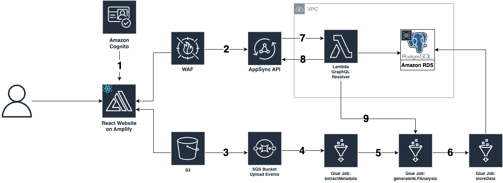

# Course Flexibility Project

The purpose of this prototype is to gain an understanding of what level of flexibility is offered to students in courses, due to the lack of aggregate knowledge and dataset of syllabi. This prototype analyzes syllabi using machine learning to determine the flexibility of courses, and displays the results on a dashboard. For more information visit the [CIC Website](https://cic.ubc.ca/). 

| Index                                               | Description                                             |
| :-------------------------------------------------- | :------------------------------------------------------ |
| [High Level Architecture](#High-Level-Architecture) | High level overview illustrating component interactions |
| [Deployment](#Deployment-Guide)                     | How to deploy the project                               |
| [User Guide](#User-Guide)                           | The working solution                                    |
| [Changelog](#Changelog)                             | Any changes post publish                                |
| [Credits](#Credits)                                 | Meet the team behind the solution                       |
| [License](#License)                                 | License details                                         |

# High Level Architecture

The following architecture diagram illustrates the various AWS components utilized to deliver the solution. For an in-depth explanation of the frontend and backend stacks, refer to the [Architecture Design](docs/ArchitectureDesign.md).

# Deployment Guide

To deploy this solution, please follow the steps laid out in the [Deployment Guide](docs/DeploymentGuide.md)

# User Guide

For instructions on how to navigate the web app interface, refer to the [Web App User Guide](docs/UserGuide.md).

# Changelog
N/A

# Credits

This application was architected and developed by Harshinee Sriram, Tien Nguyen, Visal Saosuo and Liam Driscoll with guidance from the UBC CIC technical and project management teams.

# License

This project is distributed under the [MIT License](LICENSE).
