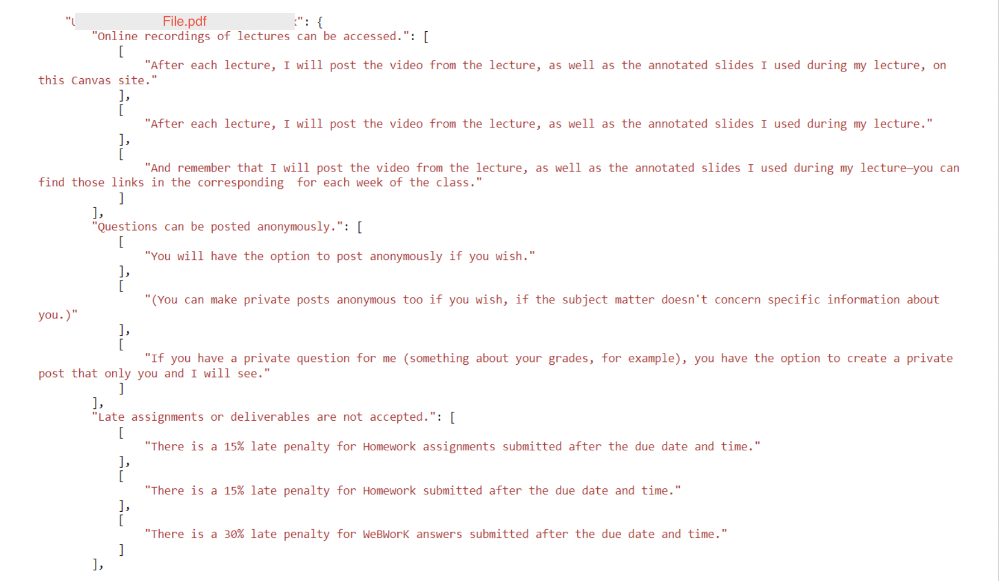
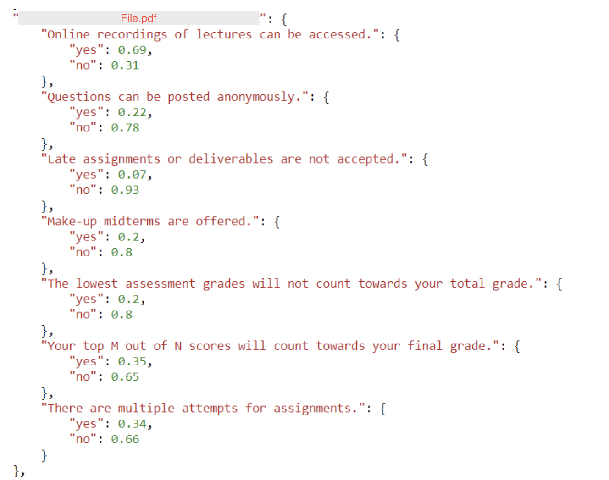

# Determining the flexibility of a course based on its syllabus file

## 1. Introduction

The challenge of this project is to gain an understanding of what level of flexibility is offered to UBC students in 100 level courses, due to the lack of aggregate knowledge and dataset of syllabi. The current solution analyzes if, given the syllabus content of a course, the course supports the following flexibility guidelines or not:

1. Online recordings of lectures can be accessed
2. Questions can be posted anonymously
3. Late assignments or deliverables are accepted
4. Make-up midterms are offered
5. The lowest assessment grades will not count towards your total grade
6. Your top M out of N scores will count towards your final grade
7. There are multiple attempts for assignments

## 2. Overview of the Deep Learning solution

1. For each flexibility guideline in a given list of flexibility guidelines, the solution does the following:
   1. With Symmetric Semantic Search [(further explained here)](#21-background-on-symmetric-semantic-search), it extracts the 3 most semantically similar sentences in the syllabus text with respect to this flexibility guideline. Together, the 3 selected sentences form the `context` for this guideline.
   2. Determine if, given the `context`, the guideline is supported by the syllabus file with the help of Yes/No Question Answering [(further explained here)](#23-background-on-text-based-question-answering).

### 2.1. Background on Symmetric Semantic Search

Semantic Search is a technique used in Natural Language Processing (NLP) to retrieve information that is semantically similar to a given query sentence (which, in this case, is a flexibility guideline), rather than relying solely on keyword matching. It aims to understand the meaning and context of the query and the documents being searched, enabling more accurate and relevant search results. Traditional keyword-based search engines rely on exact keyword matches to retrieve relevant documents. However, this approach may not capture the full meaning of a query or consider synonyms, related concepts, or context (as in the case of syllabus files where the same information can be expressed in multiple ways). 

Semantic Search, on the other hand, goes beyond individual keywords and takes into account the overall meaning and intent of a sentence by utilizing techniques such as word embeddings, Deep Learning (DL) models, and Natural Language Understanding (NLU) to capture the semantic relationships between words and phrases. These models learn to represent words and sentences in a high-dimensional space, where similar concepts are closer to each other. By leveraging these representations, semantic search algorithms can identify documents that are conceptually similar to the query, even if the exact keywords are not present.

There are two types of Semantic Search: Asymmetric and Symmetric. Asymmetric Semantic Search treats the query and search documents differently, with the query often represented in a more complex form, while Symmetric Semantic Search treats both the query and search documents equally, representing them in a shared semantic space for comparison. As our queries (i.e., our flexibility guidelines) are not complex statements and it is possible that a flexibility guideline could be present in the syllabus text in the exact same manner, we utilize Symmetric Semantic Search for our solution.

The process of Semantic Search (both Asymmetric and Symmetric) involves the following steps:

1. **Text Representation**: This step involves transforming words or sentences in the course syllabus text into numerical representations that capture their semantic meaning.
2. **Query Understanding**: This step analyzes a particular flexibility guideline, applies similar preprocessing and representation techniques as used for the text data, and generates a numerical representation of the guideline.
3. **Similarity Calculation**: Next, the semantic similarity between the flexibility guideline sentence representation and the representations of the sentences in the syllabus file is calculated with cosine similarity. The similarity scores indicate how closely related the query is to each document.
4. **Ranking and Retrieval**: Based on the similarity scores, the sentences in the syllabus file are ranked and the most relevant ones are retrieved. The sentences with higher similarity scores are considered more relevant to the flexibility guideline sentence. In our solution, we consider the top 3 most relevant sentences in the syllabus text corresponding to a flexibility guideline.

### 2.2. Details about the Symmetric Semantic Search model used in this solution

This solution leverages the `all-mpnet-base-v2` [(Hugging Face model card)](https://huggingface.co/sentence-transformers/all-mpnet-base-v2) model developed by Microsoft Research for Symmetric Semantic Search. It was trained on all available training data (more than 1 billion training pairs) and is currently the best performing model for Symmetric Semantic Search.

### 2.3. Background on Text-based Question Answering

Text-based question answering (QA) is an NLP task that involves automatically generating answers to questions posed in natural language, based on a given context or a collection of documents. It aims to mimic human-like understanding and comprehension of textual information, enabling machines to extract relevant information and provide accurate answers to user queries.

The process of text-based question answering involves the following steps:

1. **Question Understanding**: The QA system analyzes and understands the question, including its structure, intent, and the type of answer expected (e.g., a specific entity, a descriptive answer, a numerical value, etc.). In this solution, each flexibility guideline is a question.
2. **Defining the context**: In order to answer the question, the QA system needs a source of information (i.e., a context). In this solution, the context is formed by combining the top 3 most relevant sentences corresponding to a flexibility guideline (which are extracted by Symmetric Semantic Search) into a contextual paragraph.
3. **Text Extraction**: The QA system extracts relevant information from the selected context that is likely to contain the answer to the question. This can involve identifying key phrases, entities, or sentences that are most likely to provide the answer.
4. **Answer Generation**: Based on the extracted information, the QA system generates a concise and accurate answer to the question. With current state-of-the-art QA models, the answer can be in various forms, such as a single-word answer, a short phrase, a sentence, or even a paragraph.

### 2.4. Details about the Question Answering model used in this solution

This solution uses the RoBERTa language model [(paper)](https://arxiv.org/abs/1907.11692) [(Hugging Face model card)](https://huggingface.co/roberta-base) for Question Answering. RoBERTa is a language model released by researchers from Facebook AI and is an improved version of the original BERT architecture. It incorporates several enhancements on top of the original BERT model. Some of the notable improvements are [(1)](https://towardsdatascience.com/exploring-bert-variants-albert-roberta-electra-642dfe51bc23) :

1. Dynamic Masking: BERT uses static masking i.e. the same part of the sentence is masked in each epoch. In contrast, RoBERTa uses dynamic masking, wherein for different Epochs different part of the sentences are masked, making the model more robust.
2. Remove NSP Task: It was observed that the NSP task is not very useful for pre-training the BERT model. Therefore, RoBERTa is trained only with the MLM task.
3. More data Points: BERT is pre-trained on “Toronto BookCorpus” and “English Wikipedia datasets” i.e. as a total of 16 GB of data. In contrast, in addition to these two datasets, RoBERTa was trained on datasets like CC-News (Common Crawl-News) and Open WebText. The total size of these datasets is around 160 GB.
4. Large Batch size: To improve on the speed and performance of the model, RoBERTa used a batch size of 8,000 with 300,000 steps. In comparison, BERT uses a batch size of 256 with 1 million steps.

### 2.5. Modifying the current State-of-the-Art QA model for Yes/No Question Answering

As the answer of a QA system can be in many forms, it is important to inform the QA model that the only acceptable answers are "Yes" or "No" that indicated whether, given the contextual paragraph, the flexibility guideline (i.e., the question to the QA system) is supported by the course syllabus or not respectively. To provide this answering condition to the QA model, it needs to be finetuned by training on a dataset where each question has a "Yes" or "No" answer. The dataset selected for this purpose is [BoolQ](https://arxiv.org/abs/1905.10044), which was created by researchers from Google AI Language and is specifically designed for Yes/No Question Anwering tasks.

By fine-tuning RoBERTa on the BoolQ dataset, the Yes/No question answering model is trained to accurately predict whether the answer to a given question is "Yes" or "No". Hence, we use this model to check if, given the contextual paragraph, whether the a course (based on its syllabus text) supports the flexibility guideline or not.

## 3. Code explanation

Now, we move on to how these two NLP concepts have been implemented for this solution. The following is a step-by-step breakdown of the code script:

1. The script imports various Python libraries that are required for different tasks, such as file operations, Symmetric Semantic Search modeling, and Question Answering modeling.
2. The code defines a function `createDir(path)` that creates a directory and returns its path.
3. It then sets up the working environment by creating necessary directories and configuring logging.
4. Next, it accesses Glue job parameters as environment variables using the `getResolvedOptions` function.
5. Following this, the script then defines a list `campuses_to_analyze` that contains the names of campuses to be analyzed.
6. The function `download_files` is defined to download syllabus files from an S3 bucket to the local machine.
7. The function `upload_files` is defined to upload files from a directory to an S3 bucket.
8. The function `preprocess_extracted_text` is defined to preprocess extracted text by tokenizing it into sentences, removing newline and tab characters, and splitting sentences containing bullet points.
9. The functions `load_text_from_pdf`, `load_text_from_docx`, and `load_text_from_html` are defined to load text from PDF, DOCX, and HTML files, respectively. These functions extract text from the files and preprocess it using the `preprocess_extracted_text` function.
10. The function `get_embeddings` is defined to encode content into sentence embeddings using the SentenceTransformer library. It takes a list of sentences as input and returns their embeddings.
11. The function `generate_semantic_reports` performs the Symmetric Semantic Search analysis on the syllabus files. It takes the path of the syllabus files, a list of flexibility guidelines, the destination path for the generated reports, the embedder model name, and the number of top matching sentences (currently, this is set to `3` to extract the top 3 most relevant sentenecs) to retrieve as input. It then iterates over the syllabus files one by one, extracts text from different file formats, encodes the extracted sentences and guideline statements into embeddings, performs Symmetric Semantic Search to find the 3 most relevant sentenes for each flexibility guideline, and saves the results as a JSON file. The following shows a snippet of what the JSON output file looks like:

12. Moving on to the Question Anwering part, the function `predict` is a helper function that takes as input a flexibility guideline sentence, its corresponding contextual paragraph (derived from the syllabus file), the tokenizer, the trained Yes/No Question Anwering Model, and the device (CPU/GPU). The function then predicts the probabilities of "Yes" and "No" that indicate the confidence of the model in determining if, given the contextual paragraph, the flexibility guideline is supported or not.
13. The function `generate_QA_results` performs this Yes/No Question Answering analysis on all syllabus files in the queue and saves the results as a JSON file. The following shows a snippet of what the JSON output file looks like:

## 4. Disclaimer

Please note that this solution utilizes Symmetric Semantic Search and Yes/No Question answering, both of which rely on Deep Learning (DL) models. It is important to acknowledge that these models suffer from the inherent black-box problem, as the decision processes they employ to generate specific outputs are not transparent or inspectable. Consequently, there may be instances where the model fails to extract the most relevant sentence or it provides an incorrect Yes/No response, despite the contextual paragraph containing reliable information that should have led to an accurate prediction. 

Some avenues of improving this solution include:

1. Fine-tuning the Symmetric Semantic Search model on tuples of the syllabus text, the flexibility guidelines, and the ground-truth top 3 most relevant sentences in the text corresponding to each guideline.
2. Fine-tuning the Yes/No Question Answering model on the dataset of contextual paragraphs given a syllabus file and a flexibility guideline and the ground-truth "Yes" or "No" output.

However, both of these approaches require humans to personally go through each syllabus file and manually select sentences relevant to a flexibility guideline and then manually go through the generated contextual paragraphs to determine if the output should be "Yes" or "No". Additionally, in order to ensure that the trainable dataset size is large and diverse enough so that the model learns the underlying patterns in the data instead of over-fitting (i.e., memorizing) on it, human evaluations would be required for several syllabus files (possibly around 400-500 syllabus files). Hence, considering the intense time requirement, this solution relies on pre-trained models that have a general understanding of what could be semantically similar and how a context can be analyzed to produce an output for Question Answering to showcase a prototype for determining course flexibility.
