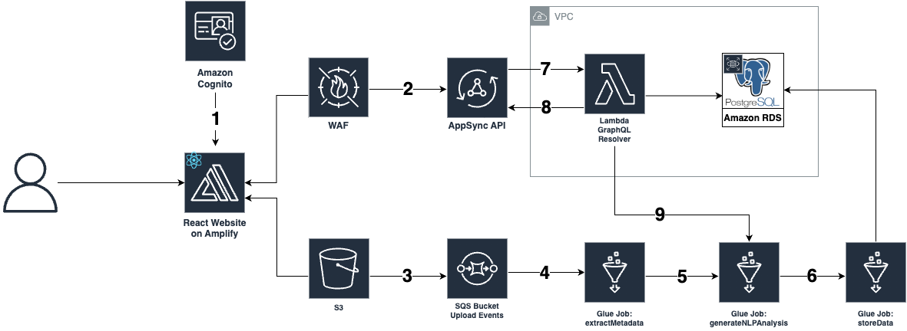

# Determining the flexibility of a course based on its syllabus file

## Table of Content

- [Determining the flexibility of a course based on its syllabus file](#determining-the-flexibility-of-a-course-based-on-its-syllabus-file)
  - [Table of Content](#table-of-content)
  - [1. Introduction](#1-introduction)
  - [2. Overview of the Deep Learning solution](#2-overview-of-the-deep-learning-solution)
    - [2.1. Background on Symmetric Semantic Search](#21-background-on-symmetric-semantic-search)
    - [2.2. Details about the Symmetric Semantic Search model used in this solution](#22-details-about-the-symmetric-semantic-search-model-used-in-this-solution)
    - [2.3. Background on Text-based Question Answering](#23-background-on-text-based-question-answering)
    - [2.4. Details about the Question Answering model used in this solution](#24-details-about-the-question-answering-model-used-in-this-solution)
    - [2.5. Modifying the current State-of-the-Art QA model for Yes/No Question Answering](#25-modifying-the-current-state-of-the-art-qa-model-for-yesno-question-answering)
  - [3. Disclaimer](#3-disclaimer)
  - [4. Cloud Infrastructure with AWS](#4-cloud-infrastructure-with-aws)
    - [Architecture](#architecture)
    - [Front-end Details](#front-end-details)
    - [Cloudformation Back-end Details](#cloudformation-back-end-details)
    - [Deep Learning Pipeline Details](#deep-learning-pipeline-details)
      - [Automatic Metadata Extraction (Glue Job: ExtractMetadata)](#automatic-metadata-extraction-glue-job-extractmetadata)
      - [Deep Learning Large Language Model (Glue Job: GenerateNLPAnalysis)](#deep-learning-large-language-model-glue-job-generatenlpanalysis)
      - [Data Insertion (Glue Job: StoreData)](#data-insertion-glue-job-storedata)
    - [Database Schema](#database-schema)
      - [Tables description:](#tables-description)
      - [Notes](#notes)
      - [Starting analysis for new guideline from the web app directly](#starting-analysis-for-new-guideline-from-the-web-app-directly)

## 1. Introduction

The challenge of this project is to gain an understanding of what level of flexibility is offered to UBC students in 100 level courses, due to the lack of aggregate knowledge and dataset of syllabi. The current solution analyzes if, given the syllabus content of a course, the course supports the following flexibility guidelines or not:

1. Online recordings of lectures can be accessed
2. Questions can be posted anonymously
3. Late assignments or deliverables are accepted
4. Make-up midterms are offered
5. The lowest assessment grades will not count towards your total grade
6. Your top M out of N scores will count towards your final grade
7. There are multiple attempts for assignments

## 2. Overview of the Deep Learning solution


1. For each flexibility guideline in a given list of flexibility guidelines, the solution does the following:
   1. With Symmetric Semantic Search [(further explained here)](#21-background-on-symmetric-semantic-search), it extracts the 3 most semantically similar sentences in the syllabus text with respect to this flexibility guideline. Together, the 3 selected sentences form the `context` for this guideline.
   2. Determine if, given the `context`, the guideline is supported by the syllabus file with the help of Yes/No Question Answering [(further explained here)](#23-background-on-text-based-question-answering).

### 2.1. Background on Symmetric Semantic Search

Semantic Search is a technique used in Natural Language Processing (NLP) to retrieve information that is semantically similar to a given query sentence (which, in this case, is a flexibility guideline), rather than relying solely on keyword matching. It aims to understand the meaning and context of the query and the documents being searched, enabling more accurate and relevant search results. Traditional keyword-based search engines rely on exact keyword matches to retrieve relevant documents. However, this approach may not capture the full meaning of a query or consider synonyms, related concepts, or context (as in the case of syllabus files where the same information can be expressed in multiple ways). 


Semantic Search, on the other hand, goes beyond individual keywords and takes into account the overall meaning and intent of a sentence by utilizing techniques such as word embeddings, Deep Learning (DL) models, and Natural Language Understanding (NLU) to capture the semantic relationships between words and phrases. These models learn to represent words and sentences in a high-dimensional space, where similar concepts are closer to each other. By leveraging these representations, semantic search algorithms can identify documents that are conceptually similar to the query, even if the exact keywords are not present.

There are two types of Semantic Search: Asymmetric and Symmetric. Asymmetric Semantic Search treats the query and search documents differently, with the query often represented in a more complex form, while Symmetric Semantic Search treats both the query and search documents equally, representing them in a shared semantic space for comparison. As our queries (i.e., our flexibility guidelines) are not complex statements and it is possible that a flexibility guideline could be present in the syllabus text in the exact same manner, we utilize Symmetric Semantic Search for our solution.

The process of Semantic Search (both Asymmetric and Symmetric) involves the following steps:

1. **Text Representation**: This step involves transforming words or sentences in the course syllabus text into numerical representations that capture their semantic meaning.
2. **Query Understanding**: This step analyzes a particular flexibility guideline, applies similar preprocessing and representation techniques as used for the text data, and generates a numerical representation of the guideline.
3. **Similarity Calculation**: Next, the semantic similarity between the flexibility guideline sentence representation and the representations of the sentences in the syllabus file is calculated with cosine similarity. The similarity scores indicate how closely related the query is to each document.
4. **Ranking and Retrieval**: Based on the similarity scores, the sentences in the syllabus file are ranked and the most relevant ones are retrieved. The sentences with higher similarity scores are considered more relevant to the flexibility guideline sentence. In our solution, we consider the top 3 most relevant sentences in the syllabus text corresponding to a flexibility guideline.

### 2.2. Details about the Symmetric Semantic Search model used in this solution

This solution leverages the `all-mpnet-base-v2` [(Hugging Face model card)](https://huggingface.co/sentence-transformers/all-mpnet-base-v2) model developed by Microsoft Research for Symmetric Semantic Search. It was trained on all available training data (more than 1 billion training pairs) and is currently the best performing model for Symmetric Semantic Search.

### 2.3. Background on Text-based Question Answering

Text-based question answering (QA) is an NLP task that involves automatically generating answers to questions posed in natural language, based on a given context or a collection of documents. It aims to mimic human-like understanding and comprehension of textual information, enabling machines to extract relevant information and provide accurate answers to user queries.


The process of text-based question answering involves the following steps:

1. **Question Understanding**: The QA system analyzes and understands the question, including its structure, intent, and the type of answer expected (e.g., a specific entity, a descriptive answer, a numerical value, etc.). In this solution, each flexibility guideline is a question.
2. **Defining the context**: In order to answer the question, the QA system needs a source of information (i.e., a context). In this solution, the context is formed by combining the top 3 most relevant sentences corresponding to a flexibility guideline (which are extracted by Symmetric Semantic Search) into a contextual paragraph.
3. **Text Extraction**: The QA system extracts relevant information from the selected context that is likely to contain the answer to the question. This can involve identifying key phrases, entities, or sentences that are most likely to provide the answer.
4. **Answer Generation**: Based on the extracted information, the QA system generates a concise and accurate answer to the question. With current state-of-the-art QA models, the answer can be in various forms, such as a single-word answer, a short phrase, a sentence, or even a paragraph.

### 2.4. Details about the Question Answering model used in this solution

This solution uses the RoBERTa language model [(paper)](https://arxiv.org/abs/1907.11692) [(Hugging Face model card)](https://huggingface.co/roberta-base) for Question Answering. RoBERTa is a language model released by researchers from Facebook AI and is an improved version of the original BERT architecture. It incorporates several enhancements on top of the original BERT model. Some of the notable improvements are <sup>[(1)](https://towardsdatascience.com/exploring-bert-variants-albert-roberta-electra-642dfe51bc23) </sup>:

1. Dynamic Masking: BERT uses static masking i.e. the same part of the sentence is masked in each epoch. In contrast, RoBERTa uses dynamic masking, wherein for different Epochs different part of the sentences are masked, making the model more robust.
2. Remove NSP Task: It was observed that the NSP task is not very useful for pre-training the BERT model. Therefore, RoBERTa is trained only with the MLM task.
3. More data Points: BERT is pre-trained on “Toronto BookCorpus” and “English Wikipedia datasets” i.e. as a total of 16 GB of data. In contrast, in addition to these two datasets, RoBERTa was trained on datasets like CC-News (Common Crawl-News) and Open WebText. The total size of these datasets is around 160 GB.
4. Large Batch size: To improve on the speed and performance of the model, RoBERTa used a batch size of 8,000 with 300,000 steps. In comparison, BERT uses a batch size of 256 with 1 million steps.

### 2.5. Modifying the current State-of-the-Art QA model for Yes/No Question Answering

As the answer of a QA system can be in many forms, it is important to inform the QA model that the only acceptable answers are "Yes" or "No" that indicated whether, given the contextual paragraph, the flexibility guideline (i.e., the question to the QA system) is supported by the course syllabus or not respectively. To provide this answering condition to the QA model, it needs to be finetuned by training on a dataset where each question has a "Yes" or "No" answer. The dataset selected for this purpose is [BoolQ](https://arxiv.org/abs/1905.10044), which was created by researchers from Google AI Language and is specifically designed for Yes/No Question Anwering tasks.


By fine-tuning RoBERTa on the BoolQ dataset, the Yes/No question answering model is trained to accurately predict whether the answer to a given question is "Yes" or "No". Hence, we use this model to check if, given the contextual paragraph, whether the a course (based on its syllabus text) supports the flexibility guideline or not.

## 3. Disclaimer

Please note that this solution utilizes Symmetric Semantic Search and Yes/No Question answering, both of which rely on Deep Learning (DL) models. It is important to acknowledge that these models suffer from the inherent black-box problem, as the decision processes they employ to generate specific outputs are not transparent or inspectable. Consequently, there may be instances where the model fails to extract the most relevant sentence or it provides an incorrect Yes/No response, despite the contextual paragraph containing reliable information that should have led to an accurate prediction. 

Some avenues of improving this solution include:

1. Fine-tuning the Symmetric Semantic Search model on tuples of the syllabus text, the flexibility guidelines, and the ground-truth top 3 most relevant sentences in the text corresponding to each guideline.
2. Fine-tuning the Yes/No Question Answering model on the dataset of contextual paragraphs given a syllabus file and a flexibility guideline and the ground-truth "Yes" or "No" output.

However, both of these approaches require humans to personally go through each syllabus file and manually select sentences relevant to a flexibility guideline and then manually go through the generated contextual paragraphs to determine if the output should be "Yes" or "No". Additionally, in order to ensure that the trainable dataset size is large and diverse enough so that the model learns the underlying patterns in the data instead of over-fitting (i.e., memorizing) on it, human evaluations would be required for several syllabus files (possibly around 400-500 syllabus files). Hence, considering the intense time requirement, this solution relies on pre-trained models that have a general understanding of what could be semantically similar and how a context can be analyzed to produce an output for Question Answering to showcase a prototype for determining course flexibility.

## 4. Cloud Infrastructure with AWS
### Architecture

[](#image-reference)


1. AWS Cognito authenticates users to the dashboard web app.
1. WAF first filters the request from the web app to protect against malicious web attacks before it reaches the Appsync GraphQL API.
1. Files are uploaded to an S3 bucket which triggers an S3 Event Notifications, which will send them to the SQS queue. This bucket also allows the front end web-app to display files.
1. The extractMetadata Glue Job programmatically receives the stored events to extract syllabi metadata. It attempts to extract the course code from the file name (e.g., CSPS_syllabus.pdf). If a valid course code is not found, it searches for the course code in the content of the syllabus file. If a valid course code is found, it matches it with the corresponding campus and faculty.
1. Files that were successfully processed will then have their S3 path transferred to the generateNLPAnalysis Glue Job. The job will use the paths to fetch the syllabi, extract the raw text and analyze it with Symmetric Semantic Search and Yes/No Question Answering. 
1. The results of the analysis and syllabi metadata is sent to the storeData Glue job, which inserts them into the database. 
1. Appsync API passes the GraphQL operations from the web app to the Lambda Resolver function to be carried out against the database.
1. The API returns the responses to the front end through the Lambda Resolver and Appsync.
1. The Lambda Resolver can also initiate a new execution of the generateNLPanalysis Glue Job to analyze new guidelines added from the front-end web app. It directly passes the newly added guideline to the generateNLPanalysis Glue Job, hence generating results for all files currently stored in the database. Previously analyzed guidelines are not reprocessed.

### Front-end Details

The web app is coded using React and Javascript and hosted on AWS Amplify. Amplify also provisions the backend resources for the app such as Cognito user/identity pool, Appsync GraphQL API and S3 storage bucket. The GraphQL API ID and the S3 bucket name are exposed to the backend CDK stacks via a custom export that stores these 2 values in System Manager's Parameter Store.

### Cloudformation Back-end Details

The backend is constructed with [AWS CDK](https://docs.aws.amazon.com/cdk/v2/guide/home.html), which generated the CloudFormation templates for all of the stacks.

- `Vpc-Stack`: provisions the VPC for this application backend
- `Database-Stack`: provisions the PostgresSQL database with Amazon RDS and a RDS Proxy.
- `Api-Stack`: imports the Appsync GraphQL API provisioned by Amplify, created the GraphQL schema and the Lambda resolver for it. AWS WAF is also provisioned.
- `DataWorkflow-Stack`: the data pipeline which first import the s3 bucket provisioned by Amplify, created a temporary bucket for Glue, and provisions AWS Glue resources such as Job, Connection. An SQS queue is also provisioned.

### Deep Learning Pipeline Details

The Deep Learning Pipeline is from step 4-6 on the [Architecture diagram](#architecture).

The SQS queue is used to hold the S3 Object Created Events since it provides direct integration with S3. The s3 event have the following [structure](https://docs.aws.amazon.com/AmazonS3/latest/userguide/notification-content-structure.html):

```json
{  
   "Records":[  
      {  
         "eventVersion":"2.2",
         "eventSource":"aws:s3",
         "awsRegion":"us-west-2",
         "eventTime":"The time, in ISO-8601 format, for example, 1970-01-01T00:00:00.000Z, when Amazon S3 finished processing the request",
         "eventName":"event-type",
         "userIdentity":{  
            "principalId":"Amazon-customer-ID-of-the-user-who-caused-the-event"
         },
         "requestParameters":{  
            "sourceIPAddress":"ip-address-where-request-came-from"
         },
         "responseElements":{  
            "x-amz-request-id":"Amazon S3 generated request ID",
            "x-amz-id-2":"Amazon S3 host that processed the request"
         },
         "s3":{  
            "s3SchemaVersion":"1.0",
            "configurationId":"ID found in the bucket notification configuration",
            "bucket":{  
               "name":"bucket-name",
               "ownerIdentity":{  
                  "principalId":"Amazon-customer-ID-of-the-bucket-owner"
               },
               "arn":"bucket-ARN"
            },
            "object":{  
               "key":"object-key",
               "size":"object-size in bytes",
               "eTag":"object eTag",
               "versionId":"object version if bucket is versioning-enabled, otherwise null",
               "sequencer": "a string representation of a hexadecimal value used to determine event sequence, only used with PUTs and DELETEs"
            }
         },
         "glacierEventData": {
            "restoreEventData": {
               "lifecycleRestorationExpiryTime": "The time, in ISO-8601 format, for example, 1970-01-01T00:00:00.000Z, of Restore Expiry",
               "lifecycleRestoreStorageClass": "Source storage class for restore"
            }
         }
      }
   ]
}
```

#### Automatic Metadata Extraction (Glue Job: ExtractMetadata)

From these S3 events, we can deduce which files were uploaded on S3 based on the `s3["object"]["key"]` attribute, which contains the key of file (s3 file path).

The first Glue Job called ExtractMetaData will programmatically receive these events by using boto3 sdk to make API calls to SQS. The metadata extraction process works like this:


In order for that process to works, a file named `course_campus_faculty_mapping.csv` must be uploaded to a bucket made for Glue, as laid out in the [Deployment Guide](DeploymentGuide.md#step-4-Uploading-the-Artifact-files-for-the-Deep-Learning-Pipeline) and the [File Preparation Guide](FilePreparationGuide.md).

First, the code will determine the campus that the syllabus file originated from based on the folder where it was uploaded. From that information, it will generate a list of all valid course codes for that campus and iterate through them. For each iteration, the course code string will be appended to a regex expression with the form `'{course_code}.?\d{3}'` where `{course_code}` is the valid course code for each iteration through the list. The expression will match pattern in the file name first, since a person will typically (although not always the case) name their file with the course code and number e.g `MATH_103_syllabus.pdf` and the course code extracted (e.g `MATH 103`) will almost always guaranteed to be the actual course that this syllabus represents.

For the majority of the cases, the course code will be encoded in the file name, but there are a few edge cases where that information could not be reliably extracted from the file name alone. In that case, the program will then use the s3 file path extracted from the S3 Event and programmatically make S3 API call and download the file's content into memory. The file will then be converted to raw text. Then:

- If only 1 unique course code is found, that course code is extracted. The logic behind this is that if someone were to write a syllabus file and only 1 unique course is extracted, then it is most likely to be the actual course of this syllabus.
- If more than 1 unique course code is found, then:
  - If there is 1 unique course code that has a higher frequency of occurrences then the other unique course codes, then that one will be extracted. The rationale behind this is that if there were to be multiple course code represented in the text, then the one that is mentioned the most will have a higher chance of being the actual one that the syllabus represents.
  - If all of the unique course codes have the same frequency of occurrences, then the unique course code that appears earliest into the text is extracted. The rationale behind this is that since we have nothing to break even, then the code that appears the earliest into the text is most likely to be the actual course code. This is due to the fact that within a syllabus file, there is usually a title/header e.g. "MATH 103: Differential Calculus".

After a valid course code is extracted, it will be matched with the correct Faculty that it belongs to, based on the Campus that was already established earlier. All metadata results will then be dumped into a csv file and passed to the next Glue Job.

#### Deep Learning Large Language Model (Glue Job: GenerateNLPAnalysis)

The Glue Job named GenerateNLPAnalysis will fetch the metadata csv file from earlier to perform the analysis. The csv file contains the file path of each file along with their metadata, however, for this step, only the s3 file path is used so that the actual file content can be downloaded into memory of the Glue job containerized environment. After the file's content has been converted to raw text, the analysis process will happened as described [here](#2-overview-of-the-deep-learning-solution).

This step will produces 2 output files, `semantic_similarity_results.json` and `question_answering_results.json`. The first file contains analysis result in json format for each syllabus file, which contains the extracted top 3 context for each flexibility guideline. The second file contains the QA result for each syllabus file, which consist of the probability of "yes" and probability of "no". They are complementary e.g a "yes" with 0.7 (70%) confidence will be equivalent to a "no" with 0.3 (30%) confidence.

The output files will be passed to the last Glue Job.

#### Data Insertion (Glue Job: StoreData)

This Glue Job store both the metadata and analysis results data into the PostgreSQL database. The database schema will be explained in detail down below.


### Database Schema


#### Tables description:

- `syllabus`: this table contains information about a syllabus file, which includes the course_code, campus, faculty, the year it was uploaded, and the actual path (key) of the file stored in the S3 bucket.
- `flexibility_guideline`: this table contains data about the flexibility guidelines added to the database, which include a guideline (e.g: "Late assignments or deliverables are accepted") and a custom shorthand code for it (e.g "LATE").
- `analysis_result`: this table contains information about the associated natural language processing results for each syllabus on each guideline. Each record contains the syllabus's unique identifier from the syllabus table, the guideline's unique identifier from the guideline table, and a set of results including the output yes/no, the confidence score for the prediction, and the top 3 sentences that support the prediction.

#### Notes

The flexibility guidelines are automatically pre-populated into the database during deployment with an AWS [Lambda scripts](../backend/cdk/lambda/triggerLambda/triggerLambda.py). Check `backend/cdk/lambda/triggerLambda/triggerLambda.py` for more details about the SQL scripts and the guidelines that are pre-inserted.

#### Starting analysis for new guideline from the web app directly

The Glue Job GenerateNLPAnalysis supports 2 "modes" of invocation, one is triggered during file uploads, and the other is triggered from the front end when a user add a new guideline to the database. When a new guideline is inserted from the webapp , this Glue Job will instead just run the analysis on that new guideline on all the syllabus entries that are stored in the database. The analysis for other guidelines that currently exists will not be rerun.
