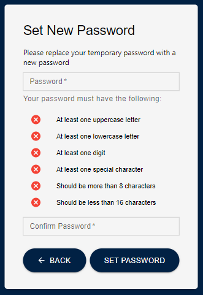

# Requirements

Before you deploy, you must have the following installed on your device:

- [git](https://git-scm.com/downloads)
- [git lfs](https://git-lfs.com/)
- [AWS Account](https://aws.amazon.com/account/)
- [GitHub Account](https://github.com/)
- [AWS CLI](https://aws.amazon.com/cli/)
- [AWS CDK](https://docs.aws.amazon.com/cdk/latest/guide/cli.html)

If you are on a Windows device, it is recommended to install the [Windows Subsystem For Linux](https://docs.microsoft.com/en-us/windows/wsl/install), which lets you run a Linux terminal on your Windows computer natively. Some of the steps will require its use. [Windows Terminal](https://apps.microsoft.com/store/detail/windows-terminal/9N0DX20HK701) is also recommended for using WSL.

# Deployment walkthrough

### Table of Contents
- [Requirements](#requirements)
- [Deployment walkthrough](#deployment-walkthrough)
    - [Table of Contents](#table-of-contents)
  - [Step 1: Clone The Repository](#step-1-clone-the-repository)
  - [Step 2: Frontend Deployment](#step-2-frontend-deployment)
  - [Step 3: Backend Deployment](#step-3-backend-deployment)
    - [Step 1: Install Dependencies](#step-1-install-dependencies)
    - [Step 2: Upload the Database secret](#step-2-upload-the-database-secret)
    - [Step 3: CDK Deployment](#step-3-cdk-deployment)
    - [Extra: Taking down the deployed stacks](#extra-taking-down-the-deployed-stacks)
    - [Step 4: Uploading the Artifact files for the Deep Learning Pipeline](#step-4-uploading-the-artifact-files-for-the-deep-learning-pipeline)
    - [Step 5: Uploading the syllabus files](#step-5-uploading-the-syllabus-files)
    - [Step 6: Invoking the Deep Learning Pipeline](#step-6-invoking-the-deep-learning-pipeline)
    - [Step 7: Creating a User](#step-7-creating-a-user)

## Step 1: Clone The Repository

First, clone the GitHub repository onto your machine. To do this:

1. Create a folder on your computer to contain the project code.
2. For an Apple computer, open Terminal. If on a Windows machine, open Command Prompt or Windows Terminal. Enter into the folder you made using the command `cd path/to/folder`. To find the path to a folder on a Mac, right click on the folder and press `Get Info`, then select the whole text found under `Where:` and copy with ⌘C. On Windows (not WSL), enter into the folder on File Explorer and click on the path box (located to the left of the search bar), then copy the whole text that shows up.
3. Clone the github repository by entering the following:

```bash
git clone https://github.com/UBC-CIC/course-flexibility.git
```

The code should now be in the folder you created. Navigate into the root folder containing the entire codebase by running the command:

```bash
cd course-flexibility
```

## Step 2: Frontend Deployment

Before deploying the source code for the webapp on Amplify we need to create the IAM Role that gives us the permissions needed to implement this solution. Run the following line of code:

```bash
aws cloudformation deploy --template-file cfn-amplifyRole.yaml --stack-name amplifyconsole-courseflexibility-backend-role --capabilities CAPABILITY_NAMED_IAM
```

If you have multiple AWS Profiles, specify one with sufficient admin permissions by appending the following text to the end of the command, replacing the profile name with the profile you would like to use for the solution. If you do this, be sure to include the same `--profile` argument for the rest of the commands starting with `aws`. The profile you are using for this project should have administrator privileges.

```bash
--profile [PROFILE NAME]
```

This step creates the IAM role called **amplifyconsole-courseflexibility-backend-role** that will be used on the next step.

The **Deploy to Amplify Console** button will take you to your AWS console to deploy the front-end solution.

<a href="https://console.aws.amazon.com/amplify/home#/deploy?repo=https://github.com/UBC-CIC/course-flexibility">
    
</a>

1. On the AWS console. select your region on the top right, then connect to GitHub.
   
2. Select the **amplifyconsole-courseflexibility-backend-role** we made previously for the deployment role, and then press `Save and Deploy`.
   
3. The deployment will take a few minutes. Wait until all green check marks show up similar to this example.
   
4. Click on left taskbar to open menu, click on Rewrites and redirects, and click on edit
5. Click and replace the first rule's source address (or add a rule if there is none) to `</^((?!\.(css|gif|ico|jpg|js|png|txt|svg|woff|ttf|docx|pdf)$).)*$/>`, click and replace target address to `/index.html`, and select and replace **type** with `200 (Rewrite)`. Add a second rule, with the source address as `</^((?!\.(css|gif|ico|jpg|js|png|txt|svg|woff|ttf|docx|pdf)$).)*$/>`, the target address as `/index.html`, and the **type** with `404 (Rewrite)`. After adding the rules, click Save.
   Refer to [AWS's Page on Single Page Apps](https://docs.aws.amazon.com/amplify/latest/userguide/redirects.html#redirects-for-single-page-web-apps-spa) for further information on why we did that
   

## Step 3: Backend Deployment

It's time to set up everything that goes on behind the scenes! For more information on how the backend works, feel free to refer to the Architecture Deep Dive, but an understanding of the backend is not necessary for deployment.

### Step 1: Install Dependencies

The first step is to get into the backend folder. Assuming you are currently still inside the root folder `course-flexibility/`, this can be done with the following commands:

```bash
cd back_end/cdk
```

Now that you are in the backend directory, install the core dependencies with the following command:

```bash
npm install
```

### Step 2: Upload the Database secret

You would  have to supply a custom database username when deploying the solution to increase security. Run the following command and ensure you replace `DB-USERNAME` with the custom name of your choice.

```bash
aws secretsmanager create-secret \
    --name courseFlexibility-dbUsername \
    --description "Custom username for PostgreSQL database" \
    --secret-string "{\"username\":\"DB-USERNAME\"}" \
    --profile your-profile-name
```

For example: you want to set the database username as "courseFlexibility"

```bash
aws secretsmanager create-secret \
    --name courseFlexibility-dbUsername \
    --description "Custom username for PostgreSQL database" \
    --secret-string "{\"username\":\"courseFlexibility\"}" \
    --profile your-profile-name
```

### Step 3: CDK Deployment

Initialize the CDK stacks (required only if you have not deployed this stack before). Note this CDK deployment was tested in `ca-central-1` region only.

```bash
cdk synth --profile your-profile-name
cdk bootstrap aws://YOUR_AWS_ACCOUNT_ID/YOUR_ACCOUNT_REGION --profile your-profile-name
```

Deploy the CDK stacks (this will take ~ 60 minutes):

You may choose to run the following command to deploy the stacks all at once. Please replace `your-profile-name` with the appropriate AWS profile used earlier:

```bash
cdk deploy --all  --profile your-profile-name
```

### Extra: Taking down the deployed stacks

To take down the deployed stack for a fresh redeployment in the future, navigate to AWS Cloudformation, click on the stack(s) and hit Delete. Please wait for the stacks in each step to be properly deleted before deleting the stack downstream. The deletion order is as followed:

1. `courseFlexibility-DataWorkflowStack` and `courseFlexibility-ApiStack` can be deleted at the same time
2. `courseFlexibility-DatabaseStack`
3. `courseFlexibility-VpcStack`

### Step 4: Uploading the Artifact files for the Deep Learning Pipeline

To be able to run the Deep Learning Pipeline, you would have to upload 2 artifact files on a designated S3 bucket. Without these 2 files, the pipeline cannot be properly executed. The files are:

1. `course_campus_faculty_mapping.csv`
1. `qa_model_weights.pth`

The file `course_campus_faculty_mapping.csv` must be prepared before uploading to S3. For step-by-step instructions on how to prepare the file, please consult this [guide](FilePreparationGuide.md).
The file `qa_model_weights.pth` can be found under the folder `backend/cdk/glue/artifacts/`, starting from root directory `course-flexibility/`.

To upload the files, follow these steps:

1. On your AWS Console, navigate to the S3 console and search for a bucket contain this identifier inside the name `glues3bucket`. **Note:** the actual full name might be the same or different since AWS sometimes append extra random character into the bucket name to make it unique. But it will always contain our custom identifier `glues3bucket` in the name.
   
1. Navigate into the bucket and click `Create folder`
   
1. Name the folder `artifacts` and click `Create folder`
   
1. Navigate into the newly created `artifacts/` folder and click `Upload`
   
1. Click Add files and a popup will open up for you to navigate the files in your local machine. Again, the file `qa_model_weights.pth` is included with this repository under the folder `backend/cdk/glue/artifacts` on your local machine. Look for the file `course_campus_faculty_mapping.csv` if you had not put it in the same local directory with the other file. After you selected those 2 files, click `Upload` and wait for the success confirmation show up in green after the upload process has completed.
   
1. Navigate back to the `artifacts/` folder on S3 to verify the 2 files had been uploaded successfully.
   

### Step 5: Uploading the syllabus files

Before uploading, it is recommended that you organize the files into their respective campuses on your local computer before continuing.

1. To upload the syllabus files on S3, first navigate to the designated S3 bucket on the S3 console. Look for a bucket with the name containing the identifier `courseflexibilitystorage`. Again, the bucket's full name might be different, but will always contain the above identifier.
   
1. Navigate into the bucket, you will see a folder called `public/` that has already been created. Click on the folder to navigate into it.
   
1. Now this is the important step. You need to create as many folders as there are unique campuses in the `course_campus_faculty_mapping.csv` file. For example, in the example file in the [guide](FilePreparationGuide.md), there are 2 unique campuses (e.g UBCV, UBCO), so you would have to create 2 folders with the **exact names** as shown below
   
1. Again, navigate inside each of those campus subfolder (e.g., UBCV, UBCO) and create a folder with the current year that you are uploading the syllabus files. The current solution assume you are uploading 1 batch of files every year. So for example, if the current date at the time that you're uploading is Wed, Jun 21, 2023, then create a folder called `2023/` in all the campus sub-folders. However, if your upload frequency is different, you may name the folder in a YYYY-MM-DD format instead (e.g., `2023-06-21/`)
   
1. Navigate into the respective subfolder and upload the file according to the campus. For example, if you are inside the `public/UBCV/2023/` subfolder then you would only upload the files that are belonged to the UBCV campus.
   
1. Similarly, navigate to the other sub-folders (e.g., `public/UBCO/2023/`) and upload their respective syllabi. If some campuses do not have syllabi, simply skip the uploading step and just keep the year folder empty.
   
1. After uploading all the syllabi into their respective folders, wait for 1-2 minutes before continuing to the next step

### Step 6: Invoking the Deep Learning Pipeline

After all syllabus files have been uploaded, navigate to the AWS Glue console

1. Click on the `Visual ETL` tab
   
1. Look for a Glue job with the exact identifier `courseFlexibility-ExtractMetadata` and click on it.
   
1. On the top right corner, click `Run`
   
1. When a green confirmation shows up, the pipeline has been successfully invoked. No further steps are needed.
   


### Step 7: Creating a User

To set up user accounts on the app, you will need to do the following steps

1. Navigate to the Amplify application that you deployed earlier on the AWS Amplify console.
   
1. Click on the `Backend environments` tab, then click on `Authentication` under **Categories added**. This view show you information about the Cognito user pool created for the web application.
   
1. Click on `View in Cognito` to be redirected to the Cognito console
   
1. On the Cognito console, make sure you are on the `Users` tab. Then click on `Create user`.
   
1. Under **Invitation message**, select `Send an email invitation`. Input the user's email address under the **Email address** field. Finally, under **Temporary password**, select `Generate a password` and click `Create user`.
   
1. The user will receive an email to the email address that was previously entered containing their temporary password.
   
1. When the user enters their email and temporary password on the sign in page of the app, they will then be prompted to replace their temporary password by setting a new password. <br>
   
1. The new user account has been created!
