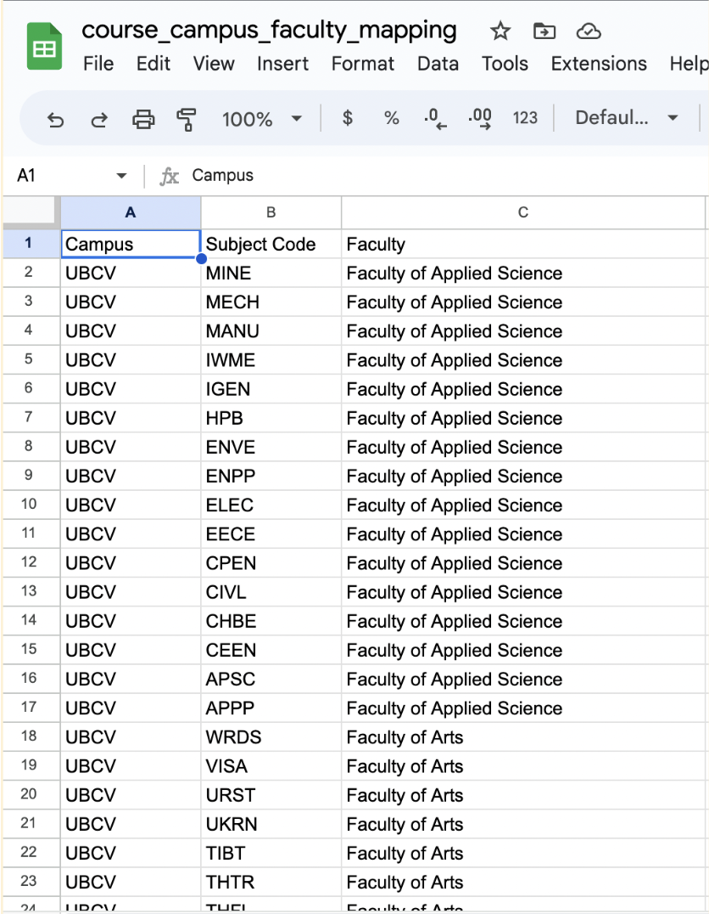
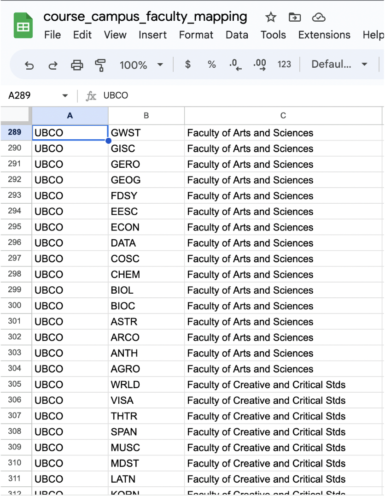
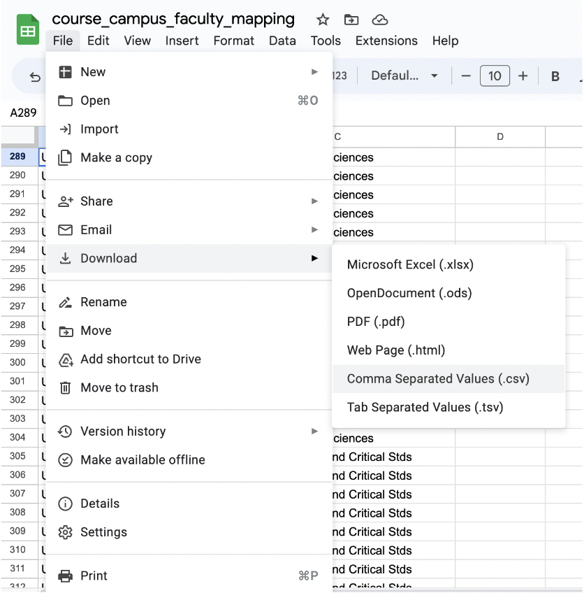

# File Preparation Guide

## course_campus_faculty_mapping.csv

This files containing information that map an Institution's campus to its constituent Faculty and Course Codes. To prepare the file, simply use any spreadsheet software (Excel, Google Sheets, etc) or just a plain text editor and enter the corresponding mapping values. Note that there should be 3 columns in the file with these exact names **Campus**, **Subject Code**, and **Faculty**.

The example belows was performed on Google Sheet:

1. Enter the campus name, subject code (course code) and faculty in the appropriate column. For the campus column, we recommend using an abbreviation. In this example, we have a campus called UBCV.
    
2. If you have multiple campus, simply enter the correct information similar to how you did for the previous campus. Ensure that information for the new campus is in the same csv file as the previous campus(es). In this example, we adding mapping information for an extra campus called UBCO.
    
3. Save as a csv format
    
4. Optional but highly recommended: put the file inside the directory `backend/cdk/glue/artifacts` along with the file `qa_model_weights.pth`.

## Important

Please make notes of the unique campus names in the Campus column (e.g UBCV, UBCO from the example). This will information will be vital to the syllabus file uploading process. Please refer back to the [Deployment Guide](DeploymentGuide.md#step-5-uploading-the-syllabus-files) for more details.
