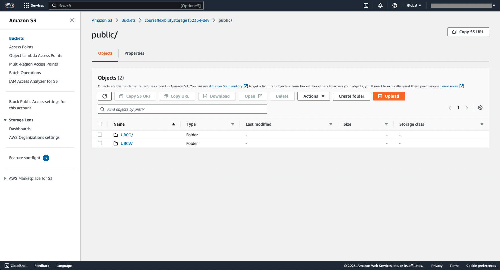
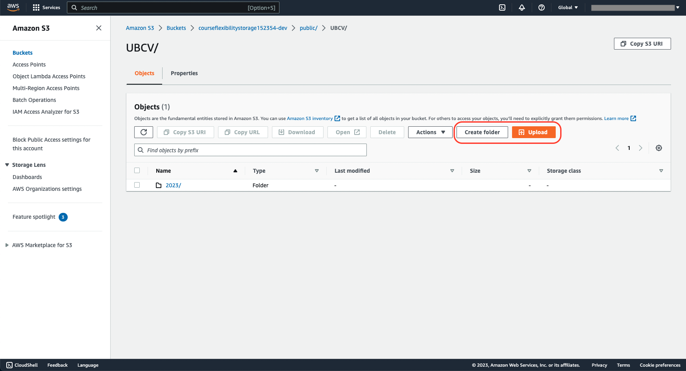
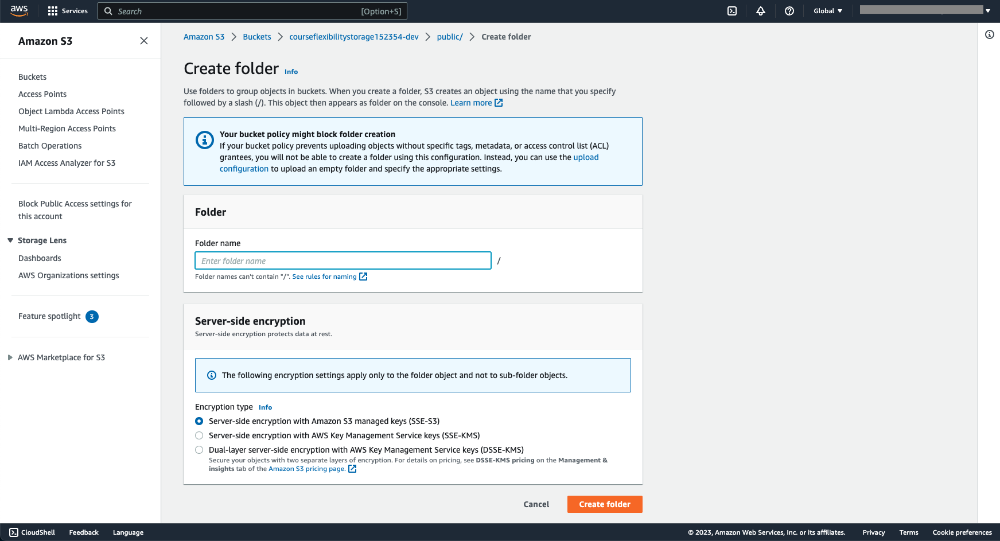
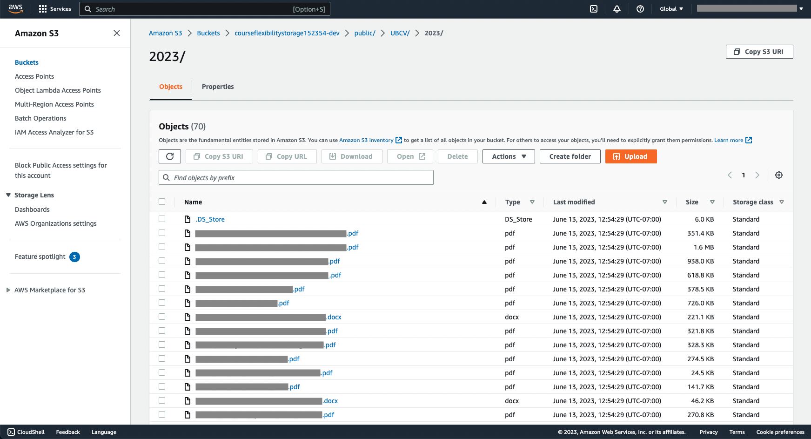

# User Guide

**Before Continuing with this User Guide, please make sure you have deployed the frontend and backend stacks.**

- [Deployment Guides](./DeploymentGuide.md)

| Index                                        | Description                                           |
| :------------------------------------------  | :---------------------------------------------------- |
| [Dashboard](#Dashboard)                      | Data visualization based on faculty and campus        |
| [Course](#Course)                            | Data visualization based on courses                   |
| [Setting](#Setting)                          | Make changes to guidelines                            |
| [Load Syllabi](#Load-Syllabi)                | Load new syllabi to the system                        |

**Note:** The screenshots contained in this User Guide show some information as redacted to obscure data that is not fully up to date.
 

## Dashboard

The Dashboard page shows the two types of content ([Faculty](#Faculty) and [Campus](#Campus)). The tab on top allows a user to switch between the two contents. In each content, there is a filtering mechanism to search through data. Below the filter component, there is a data visualization, mainly in the form of a table.

### Faculty
By default, the dashboard page will load the faculty page. A user can also access the faculty page through the top tab below the main navigation bar. This page contains a table with information about each faculty in the database.

A user can access a more detailed analysis of a faculty by clicking the arrow on the right of each faculty (i.e., each row). This will open another tab as shown in the [Faculty Analysis](#Faculty-Analysis) screenshot.

#### Faculty Analysis
The graph below shows the number of courses, in percentage, of a selected faculty (e.g., Faculty of Science) that were analyzed as "Yes" for a given guideline. Hovering the mouse cursor on the data points, user can see a detailed result of each guideline in a given year. For example, 81% of all the courses in the Faculty of Science analyzed as "Yes" to "online recordings of lectures can be accessed" (i.e., REC) guideline in 2023.

### Campus
A user can access the campus page through the top tab under the main navigation bar. This page contains a table with information about each campus.

A user can access a more detailed analysis of a campus by clicking the arrow on the right of each campus. This will open another tab as shown in the [Campus Analysis](#Campus-Analysis) screenshot.

### Campus Analysis
The graph below is similar to the graph in the [Faculty Analysis](#Faculty-Analysis) page, except that the data is based on the selected campus.

## Course
This page is accessed by clicking on the main navigation bar called "Courses". This page will give analysis results into each course.

On the top of the page is the filter function which includes a filter base on campus, course subject, course number, and faculty. There is also an [Advanced Filter](#Advanced-Filter) option to archive more complex filters. 

Below the filter is a table showing the meta-data of a course and an analysis summary in each row. Similar to the faculty/campus page, clicking on the arrow on the right will bring a user to the [Course More Detail](#Course-More-Detail) page. Clicking on any box in the Analysis Result column will load a pop-up explaining the result as shown in [Course Pop Up](#Course-Pop-Up). Each box has various colors depending on the analysis: 
* Green indicates "Yes" result
* Red indicates "No" result
* Orange indicates "Maybe" result

### Advanced Filter
There are four options to select for each guideline: All, Yes, Maybe, and No.
* All, means don't care (i.e., display everything regardless of the result)
* Yes, display only the result that is "Yes"
* Maybe, display only results that could not distinguish between "Yes" and "No"
* No, display only results that is "No"

### Course Pop Up
The Pop-up gives detail about what the guideline code represents, the result in text form, and the confident level.

### Course Load More
The load more button below the table will load new data from the database. This button will be hidden after it loads all the data available.

**Note:** When doing filters on the table, it only filters data that is currently loaded (i.e., not the data in the database). Hence, a user has to load new data to keep filtering new ones.

 

#### Course More Detail
This page gives details on the meta-data of the course, the syllabus, and an analysis of each guideline. The analysis of each guideline shows the result in numeric form and also the sentences that the machine learning model extracted from the syllabus. 

**Note:** The syllabus view only shows the PDF format. A user has to download the document if the syllabus is in a different file type than PDF. To download a document, the user can click on the blue text called "Open File".

 

## Setting
This page is accessed by clicking on the main navigation bar called "Settings". This will give a user the ability to add/remove guidelines.

In the middle is a list of guidelines that are analyzed or currently analyzed.

### Add Guideline
By clicking on the green plus button at the bottom, the webpage will load a form to add new guidelines. The first text box is the description of the guideline. The guideline description should be unique and descriptive enough for the module to search through each syllabus. The second text box is the shortcut or label for guidelines; this should also be unique from other guidelines.

Clicking ADD GUIDELINE will show a pop-up for an [Add Guideline Pop Up](#Add-Guideline-Pop-Up).

### Add Guideline Pop Up
The pop-up is just to confirm if a user wants to add the guideline and is happy with the description and shortcut. Clicking ADD & START will add the guideline to the database and trigger the ML model to analyze all courses with that new guideline.

**Note:** The analysis process takes some time to complete, please be patient with that. In addition, there are up to 7 guidelines that could run at the same time.

 

### Delete Guideline Pop Up
To delete guideline(s), a user needs to select guideline(s) to delete, and a delete button will pop up. After clicking DELETE SELECTED, a pop-up confirmation will be shown.

# Load Syllabi
To load new guidelines, users need to use the AWS Console interface. In the AWS Console: 
1. Search for Amazon S3 in the search bar and click on it
2. On the left navigation bar, click on "Buckets" 
3. Search for "courseflexibilitystorage152354-dev"
4. Go to the "public" folder
5. Select the campus to upload the syllabi, as can be seen in Fig LS1
6. Select a year or create a new year by clicking "Create Folder" as shown in Fig LS2
7. A new page is open as shown in Fig LS3. A user need to provide a folder name and leave the default setting. Then click "Create Folder".
8. Click on the newly created folder and click "Upload" as shown in Fig LS4.

 

*Fig LS1. AWS Console for selecting campus.*
 

*Fig LS2. AWS Console for selecting year.*
 

*Fig LS3. AWS Console for creating a folder.*
 

*Fig LS4. AWS Console for uploading syllabi.*
