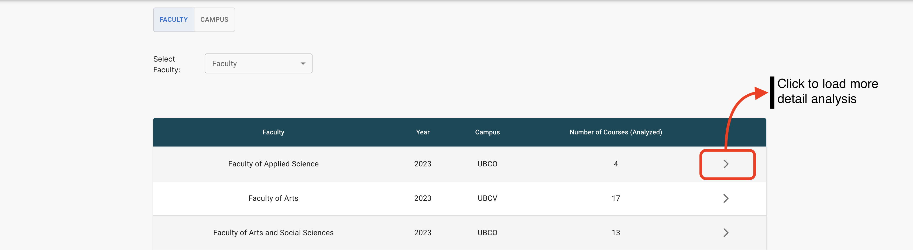
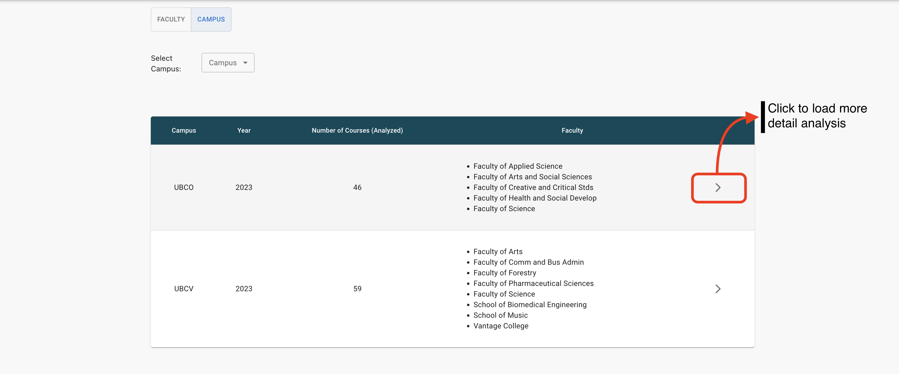
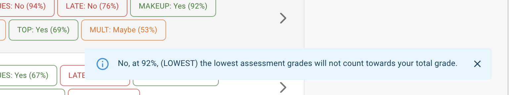
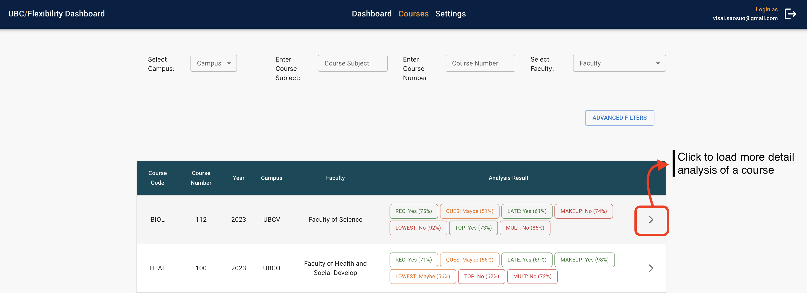

# User Guide

**Before Continuing with this User Guide, please make sure you have deployed the frontend and backend stacks.**

- [Deployment Guides](./DeploymentGuide.md)

Once you have deployed the solution, the following user guide will help you navigate the functions available.

| Index                                        | Description                                           |
| :------------------------------------------  | :---------------------------------------------------- |
| [Dashboard](#Dashboard)                      | Data visualization based on faculty and campus        |
| [Courses](#Courses)                            | Data visualization based on courses                   |
| [Settings](#Settings)                          | Make changes to guidelines                            |
| [Load Syllabi](#Load-Syllabi)                | Load new syllabi to the system                        |

**Note:** The screenshots contained in this User Guide show some information as redacted to obscure data that is not fully up to date.
 

## Dashboard

The Dashboard page shows two types of content ([Faculty](#Faculty) and [Campus](#Campus)). The tab on top allows a user to switch between the two contents. In each content, there is a filtering mechanism to search through data. Below the filter component, there is a table that displays information about each faculty/campus.

### Faculty

By default, the dashboard page will load the faculty page. A user can also access the faculty page through the top tab below the main navigation bar. This page contains a table with information about each faculty in the database including:

* Faculty - name of the faculty available
* Year - a list containing the year where the data has analyzed
* Campus - name of the campus where the faculty is offered
* Number of Courses (Analyzed) - the number of courses that have been analyzed throughout the year for a specific faculty

A user can access a more detailed analysis of a faculty by clicking the arrow on the right of each faculty (i.e., each row). This will open another tab as shown in the [Faculty Analysis](#Faculty-Analysis) screenshot.

#### Faculty Analysis
This page can be accessed by clicking on the right pointing arrow of each faculty.

The graph below shows the number of courses, in percentage, of a selected faculty (e.g., Faculty of Science) that were analyzed as "Yes" for a given guideline. By hovering the mouse cursor on the data points, a user can see a detailed result of each guideline in a given year. For example, 81% of all the analyzed courses in the Faculty of Science were analyzed as "Yes" for the "online recordings of lectures can be accessed" (i.e., REC) guideline in 2023. Each guideline has a guideline code or shortcut to help shorten the representation of a guideline.

### Campus

A user can access the campus page through the top tab under the main navigation bar. This page contains a table with information about each campus.

* Campus - the name of the campus available
* Year - a list containing the year where the data was analyzed
* Faculty - a list of faculty where the data has been analyzed for a specific campus

A user can access a more detailed analysis of a campus by clicking the arrow on the right of each campus. This will open another tab as shown in the [Campus Analysis](#Campus-Analysis) screenshot.

 to do 1

### Campus Analysis
This page can be accessed by clicking on the right pointing arrow of each campus.

The graph below is similar to the graph in the [Faculty Analysis](#Faculty-Analysis) page, except that the data is based on the selected campus.

## Courses

This page is accessed by clicking on the main navigation bar called "Courses". This page will give analysis results for each course.

On the top of the page are the filters which include a filter base on campus, course subject, course number, and faculty. There is also an [Advanced Filter](#Advanced-Filter) option to access more complex filters. 

Below the filters is a table showing the meta-data of a course and an analysis summary in each row. It includes the following:

* Course Code - the subject of a course
* Course Number - the number of a course
* Year - the year where a course was analyzed
* Campus - the campus where a course is in
* Faculty - the name of the faculty a course belongs to
* Analysis Result - a summary of the analysis from the machine learning model

Similar to the faculty/campus page, clicking on the arrow on the right will bring a user to the [Course More Detail](#Course-More-Detail) page. Clicking on any box in the Analysis Result column will load a pop-up explaining the result as shown in [Course Pop Up](#Course-Pop-Up). Each box has various colors depending on the analysis: 
* Green indicates "Yes" result
* Red indicates "No" result
* Orange indicates "Maybe" result

 to do 2

### Advanced Filter

There are four options to select for each guideline: All, Yes, Maybe, and No. When a guideline is analyzed as Yes, it means that the machine learning model is agreed with the guideline; this also applies to No and Maybe which disagree or unsure with the guideline, respectively. 

Use the guideline “Online recordings of lectures can be accessed” as an example. If the result of this guideline is “Yes” for a syllabus, then that means that the machine learning model determined that the extracted sentences from that syllabus support the guideline (i.e., The model determined that: Online recordings of lectures **can** be accessed). If the result of this guideline is “No”, then that means that the machine learning model determined that the extracted sentences do not support the guideline (i.e., The model determined that: Online recording of lectures **cannot** be accessed). Finally, if the result of the guideline is “Maybe”, then that means that the machine learning model lacks confidence in whether the extracted sentences support or do not support the guideline (i.e., The model determined that: Online recordings of lectures can **maybe** be accessed). 

* All, means all courses (i.e., display everything regardless of the result)
* Yes, means display only results that are "Yes" (i.e., a list of syllabi that agree with a guideline)
* Maybe, means display only results that could not distinguish between "Yes" and "No" (i.e., a list of syllabi that are unsure if they agree or disagree with a guideline)
* No, means display only results that are "No" (i.e., a list of syllabi that disagree with a guideline)

### Course Pop-Up

The Pop-up gives detail about the result of the analysis in text form (Yes, No, or Maybe), the confidence level in percentage, and a guideline description based on the selected guideline code. The pop-up is shown when the user clicks on one of the result boxes in the Analysis Result section. The pop-up is located at the bottom right corner of the screen, and it should hide around six seconds after it has been clicked.
 to do 3

Here is a closer look at the pop-up.

### Load More Button on Course Page

The load more button below the table will load new data from the database in the cloud. This button will be hidden after it loads all the data available.

**Note:** When doing filters on the table, it only filters data that is currently loaded (i.e., not the data in the database). Hence, if a user wants to get all the results for a selected filter, the user has to load all the data from the data first and then apply the filters.
 

 to do 4

#### Course More Detail
This page can be accessed by clicking on the right pointing arrow of each course.
 to do 5

This page gives details on the meta-data of the course, the syllabus, and an analysis of each guideline. The analysis of each guideline shows the result as a confidence score and also the sentences that the machine learning model extracted from the syllabus. The confidence score is a percentage that represents how accurately the model is detected for a guideline. The higher the confidence score, the more accurate the model detects.

**Note:** The syllabus view only shows the PDF format. A user has to download the document if the syllabus is in a different file type than PDF. To download a document, the user can click on the blue text called "Open File".

 

 to do 6

## Settings

This page is accessed by clicking on the main navigation bar called "Settings". This allows a user to add or remove guidelines and rerun the machine learning model on all the syllabi.

In the middle is a list of guidelines that are analyzed or are currently being analyzed. It provides information such as guideline shortcuts (or guideline codes) and guideline descriptions which can be used as a reference to look for the meaning of a guideline shortcut.

### Add Guideline

By clicking on the green plus button at the bottom, the webpage will load a form to add new guidelines. The first text box is the description of the guideline. The guideline description should be unique and descriptive enough for the model to search through each syllabus. The second text box is the shortcut or label for guidelines; this should also be unique from other guidelines, and it helps to shorten the representation of a guideline throughout the page.

Clicking ADD GUIDELINE will show a pop-up for an [Add Guideline Pop Up](#Add-Guideline-Pop-Up).

### Add Guideline Pop Up

The pop-up is just to confirm if a user wants to add the guideline and is happy with the description and shortcut. Clicking ADD & START will add the guideline to the database and trigger the ML model to analyze all courses with that new guideline.

**Note:** The analysis process takes some time to complete, please be patient with that. In addition, there are up to 7 guidelines that could run at the same time.

 

### Delete Guideline Pop Up

To delete guideline(s), a user needs to select guideline(s) to delete, and a delete button will pop up. After clicking DELETE SELECTED, a pop-up confirmation will be shown.

**Note:** If a guideline is accidentally deleted, a user can just add the guideline again by following the [Add Guideline](#Add-Guideline) section.

# Load Syllabi

A user may want to add more syllabi to conduct an analysis of these new syllabi. The new syllabi’s results would be displayed on the web app along with the results of the syllabi that are already in the database once the analysis process is finished. To add new syllabi for analysis, the user needs to use the AWS Console interface. The developers should grant access information (including username and password) to the AWS Console. In the AWS Console:

1. Search for Amazon S3 in the search bar and click on it
2. On the left navigation bar, click on "Buckets" 
3. Search for the bucket whose name contains the identifier `courseflexibilitystorage`. Note that the full name will have some more characters, but will always
contain the string `courseflexibilitystorage`.
4. Go to the "public" folder
5. Select the campus to upload the syllabi
   
7. Select a year or create a new year by clicking "Create Folder".
   
9. A new page is open as shown in the screenshot below. A user needs to provide a folder name and leave the default settings. Then click "Create Folder". To keep things simple, a user needs to only provide the year in integer form like "2023" or "2024".
   
11. Click on the newly created folder and click "Upload".
  

After loading all the data to AWS Console the machine learning model will automatically trigger to start the analysis process. 

**Note:** This process of loading data to the database could be complicated. Some future considerations for developers might be to create a user interface for loading syllabi. The interface should handle all the processes needed to accomplish the step above in a more user-friendly way.
