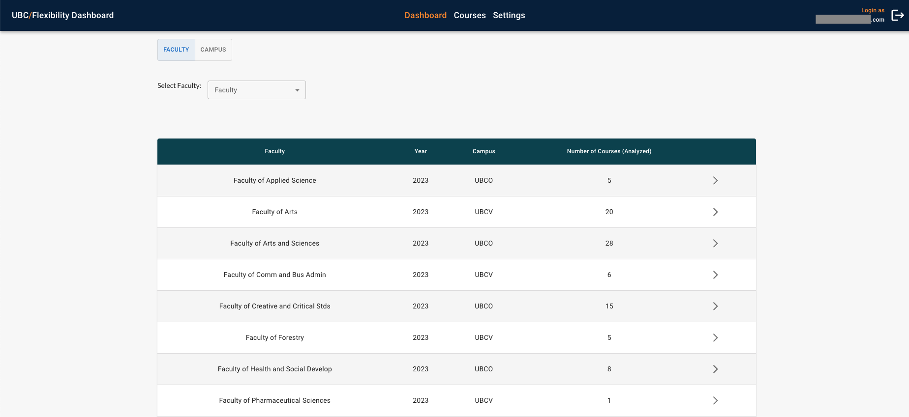
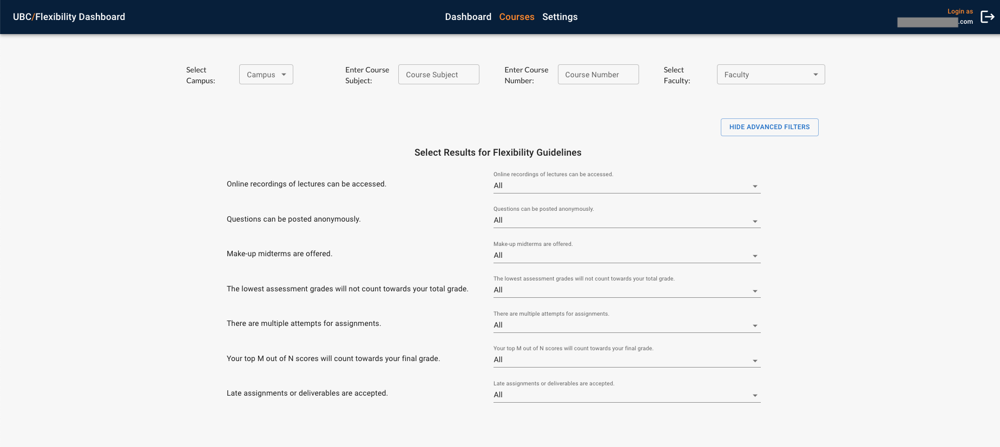
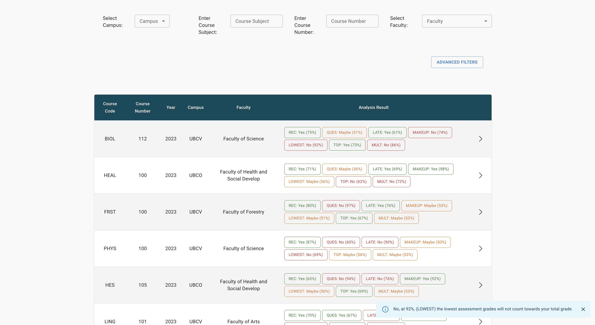
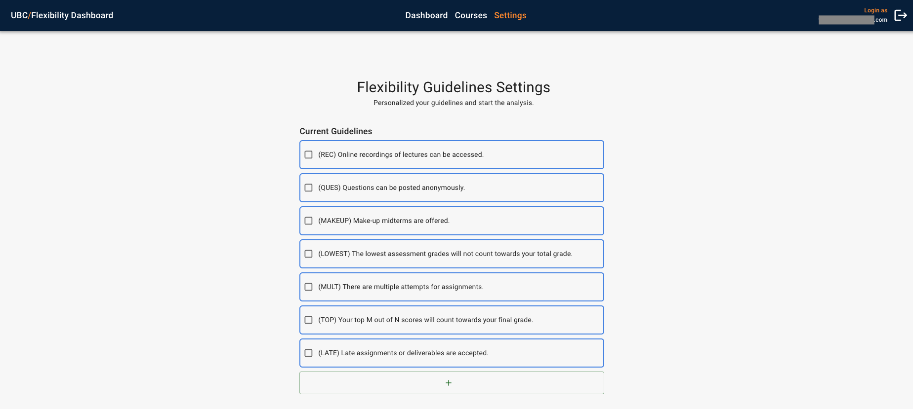

# User Guide

**Before Continuing with this User Guide, please make sure you have deployed the frontend and backend stacks.**

- [Deployment Guides](./DeploymentGuide.md)

| Index                                        | Description                                           |
| :------------------------------------------  | :---------------------------------------------------- |
| [Dashboard](#Dashboard)                      | Data visualization based on faculty and campus                    |
| [Course](#Course)                | Search through each courses                 |
| [Setting](#Setting)              | Make changes to guidelines                                   |
| [Load Syllabus](#Load-Syllabus)              | Load new syllabus to the system|

**Note:** The screenshots contained in this User Guide show some information as redacted to obscure data that is not fully up to date.
 

## Dashboard

The Dashboard page shows the two types of content ([Faculty](#Faculty) and [Campus](#Campus)). The tab on top allows user to switch between the two contents. In each conents there is a filtering mechanism to better search through data. Below a filtering option, there is a data visualization mainly in the form of a table.

### Faculty
By default, dashboard page will load the faculty page. User can also access the faculty page through the top tab as mentioned above. This page contains a table with info about each faculty in the database.

User can access a more detail analysis of a faculty by clicking the arrow on the right of each faculty. This will open another tab as shown in [Faculty Analysis](#Faculty-Analysis) screenshot.

#### Faculty Analysis
The graph below shows the amount of courses, in percentage, of a selected faculty (e.g., Faculty of Science) that analyzed as "Yes" for a given guideline. Hover the mouse cursor on the data points will give a detail result of each guideline in a given year. For example, 81% of all the courses in the Faculty of Science analyzed as "Yes" to "online recordings of lectures can be accessed" (i.e., REC) guideline in 2023.

### Campus
User can access the campus page through the top tab under main navigation bar. This page contains a table with info about each campuse.

User can access a more detail analysis of a campus by clicking the arrow on the right of each campus. This will open another tab as shown in [Campus Analysis](#Campus-Analysis) screenshot.

### Campus Analysis
The graph below is similar to the graph in the [Faculty Analysis](#Faculty-Analysis) page, except that the data is based on a selected campus.

## Course
This page can be accessed by clicking on the main navigation bar call "Courses". This will give analysis results into each courses.

The top row of the page shows various filters including campus, course subject, course number, and faculty. There are also [Advanced Filter](#Advanced-Filter) option to archive more complex filter. 

Below the filter is a table showing meta-data of a course and analysis summary in each row. Similar to faculty/campus page, clicking on the arrow on the right will bring user to the [Course More Detail](#Course-More-Detail) page. Clicking on any box in the Analysis Result column will load a pop up explaining the result as shown in [Course Pop Up](#Course-Pop-Up). Each box has various color depending on the analysis: 
* Green indicates "Yes" result
* Red indicates "No" result
* Orange indicates "Maybe" result

### Advanced Filter
There are four option to select for each guideline: All, Yes, Maybe, and No.
* All, any result is choosen or don't care
* Yes, only result that is "Yes"
* Maybe, only result that could not distinguish between "Yes" and "No"
* No, only result that is "No"

### Course Pop Up
Pop up gives detail to what is the guideline code stand for, the result in text and percentage.

### Course Load More
The load more button below the table will load new data from the database. This button will be hidden after it loads all the data available.

**Note:** When doing filters on the table, it only filters data that is currently loaded. Hence, user has to load new data to keep filtering new ones.
 

#### Course Analysis
This page give details to meta data of the course, the syllabus, and analysis of each guideline. The analysis of each guideline shows the result in numeric form and also the sentence that the machine learning model extracted from the syallabus. 

**Note:** The syllabus view only shows the PDF file. Users has to download the document if there is a different file type than a PDF. Downloading document, user can click on the blue text call "Open File".
 

## Setting
This page can be accessed by clicking on the main navigation bar call "Settings". This will give user to add/remove guidelines.

In the middle is a list of guidelines that is analysized or currenly analysizing.

### Add Guideline
Clicking on the green plus button at the bottom will load a form to add new guideline. The first text box is the description of the guideline. The guideline description should be unique and descriptive enough for the module to search through syllabus. The second text box is the shortcut or lable for guideline; this should also unique from other guidelines.

Clicking ADD GUIDELINE will show a pop up for an [Add Guideline Pop Up](#Add-Guideline-Pop-Up).

### Add Guideline Pop Up
The pop up is just to confirm if user wants to add the guideline and happy with the description and shortcut. Clicking ADD & START will add the guideline in the data base run the ML module to analyze all courses with that new guideline.

**Note:** The analysis process takes some time to complete, please be patience with that. In addition, there are up to 7 guidelines that could be run at the same time.
 

### Delete Guideline Pop Up
To delete guideline(s), user need to select guidelines(s) to delete and a delete button will pop up. After clicking DELETE SELECTED, a pop up confirmation will be shown.
